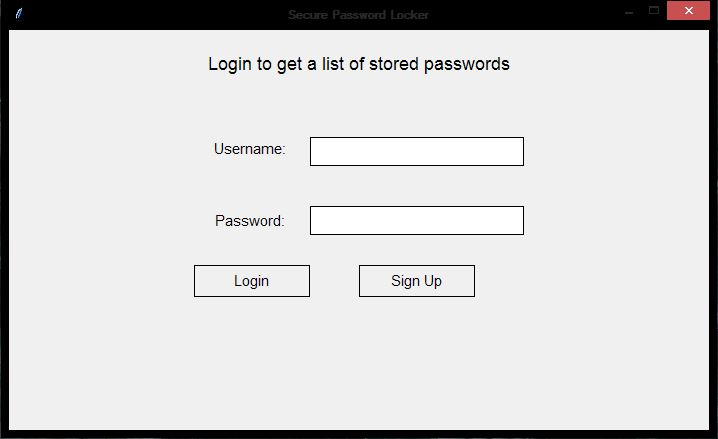
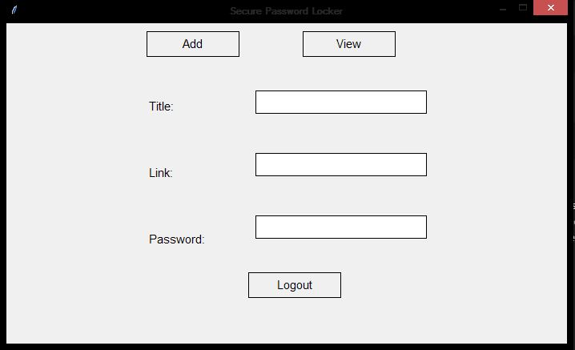
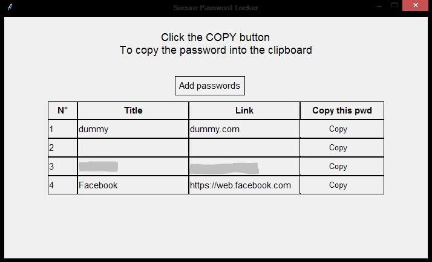

# password-locker-tkinter :100:



## Description
A tkinter application that allows the user to store passwords in a secure place with an encryption on them where none can access your data if he or she don't have the login password. In order to use the application you need to have python installed, and the all the modules that I have used in this application.

## Running application
In order to run the application,
- clone this repository locally to your computer.
```
git clone https://github.com/sam0132nodier/password-locker-tkinter
```
- Navigate to the repository folder
```
cd password-locker-tkinter
```
- Open the terminal
- Run `app.py` file in terminal
```
python app.py
```

## How to use



Once you got the application up and running, if it's your first time to run the application you have to create an account by clicking **sign up** button and fill in all the credentials.
You will then be directed to the place where you'll enter the data related to the password you want to store. These include **title, link, and password**.

Fill in the credentials as needed and then click on add password button to save the password into the database embedded with the application.

After having couple your passwords stored in the application database, you can now go to **View** passwords, to see the list of stored passwords.



From this point you have to click on Copy button next to every password to get your password _copied into your clipboard_ and the paste it wherever you want.

<div style="color: orange;">
    NOTE: Anytime there is a problem adding, accessing, or modifying data. There is a helpful message at the bottom of the application.
</div>

## App dependencies

- `os` [Comes with `python3.8`]
- `sqlite3` [`pip install sqlite3`]
- `uuid` [`pip install uuid`]
- `tkinter` [`pip install tkinter`]
- `pyperclip` [`pip install pyperclip`]
- `cryptography.fernet` [**Fernet** `pip install cryptography`]

## App specification

The functionalities and specification of the application can be easily viewed in **TODO.md** file where I walk through what I did to get the full functioning application.

## Contribution

